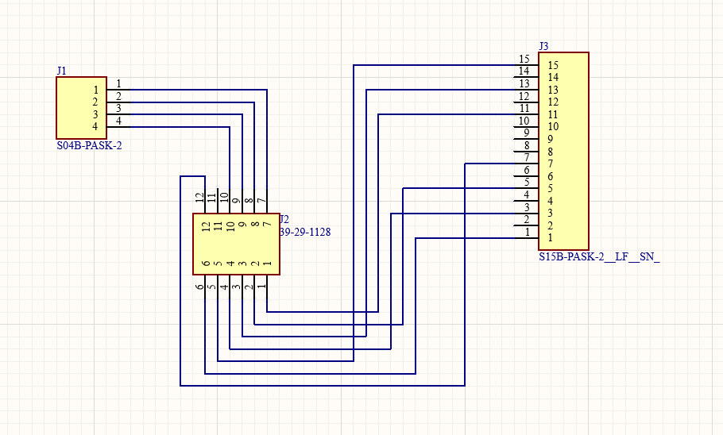
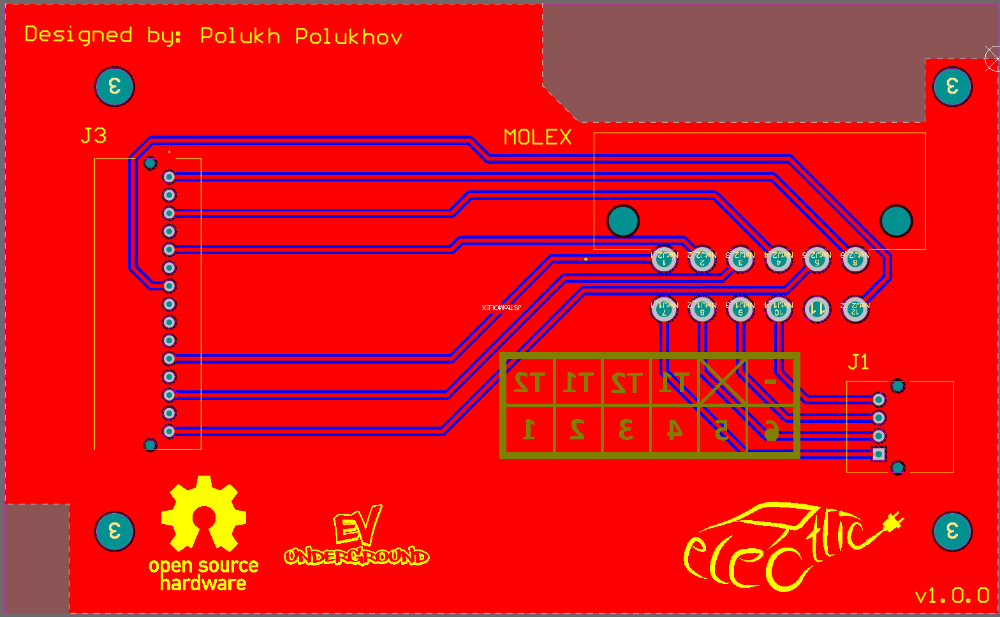

# Tesla Cell Tap PCB

This schematic and PCB is used as a drop-in replacement Tesla Model S and X battery packs to connect them with third-party peripherals.

## Schematic



## Board Design



## Usage

Clone this repo and open in Altium Designer

```bash
git clone https://github.com/relectric-car-team/pcb-tesla-cell-tap.git
```

## Contributing

Pull requests are welcome. For major changes, please open an issue first to discuss what you would like to change.

## License

[MIT](LICENSE)
